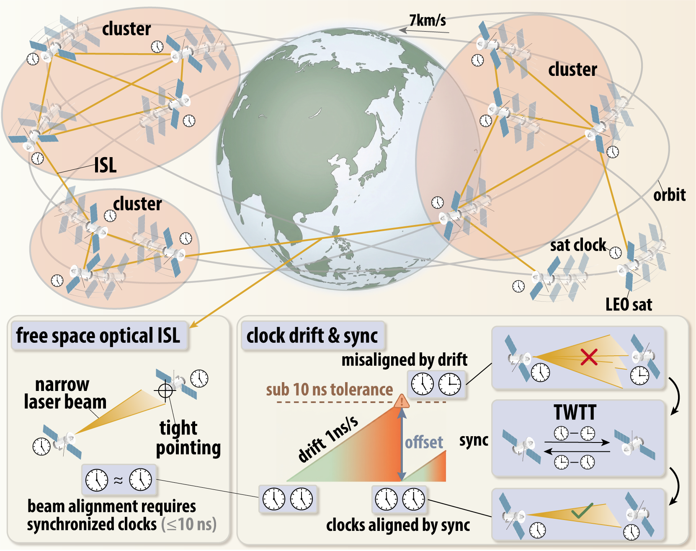
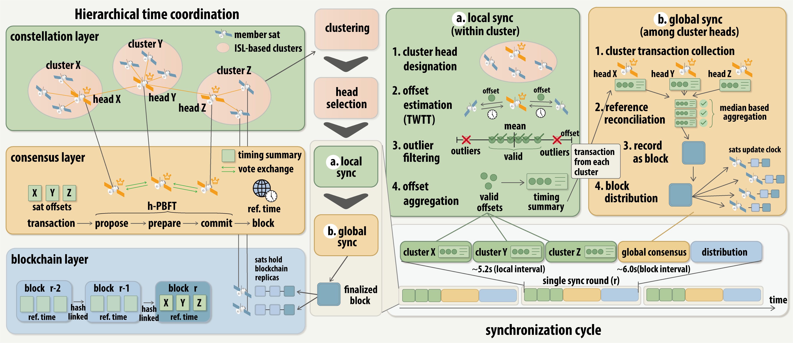
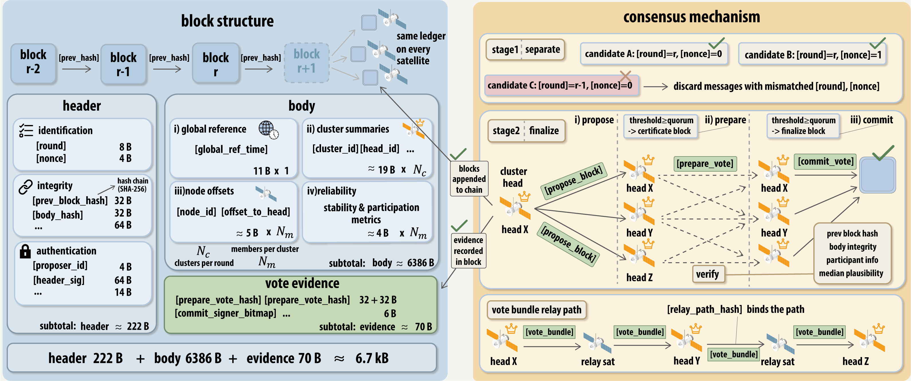
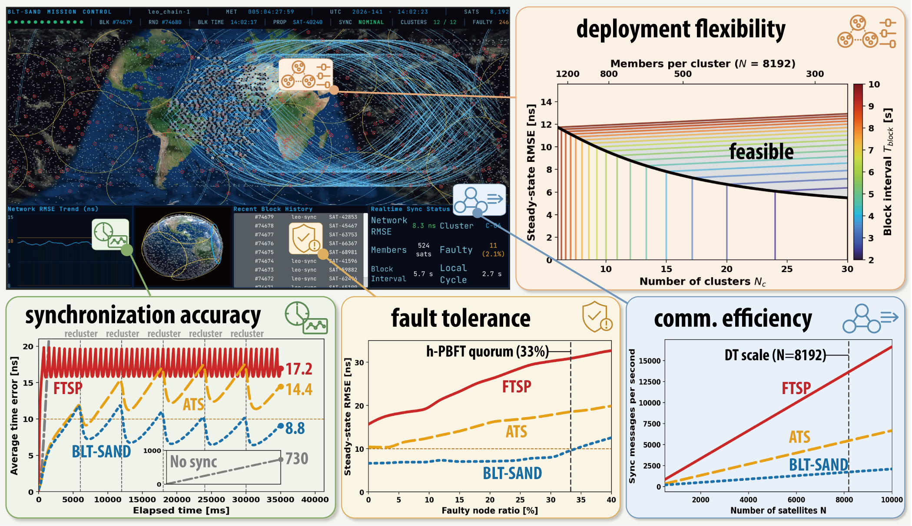
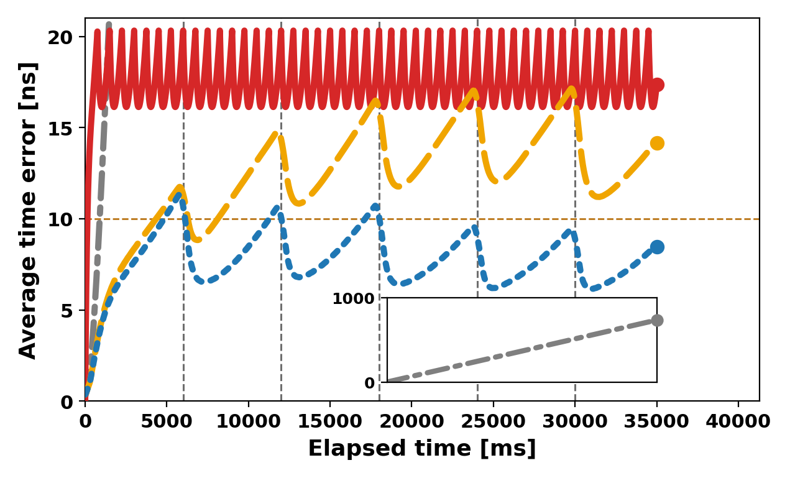
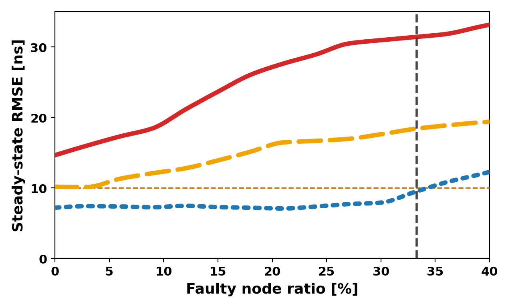
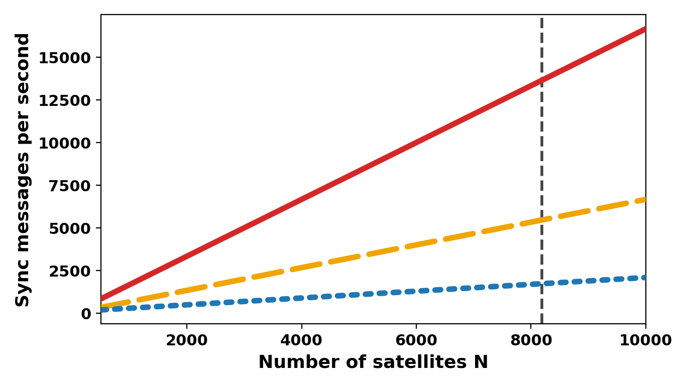
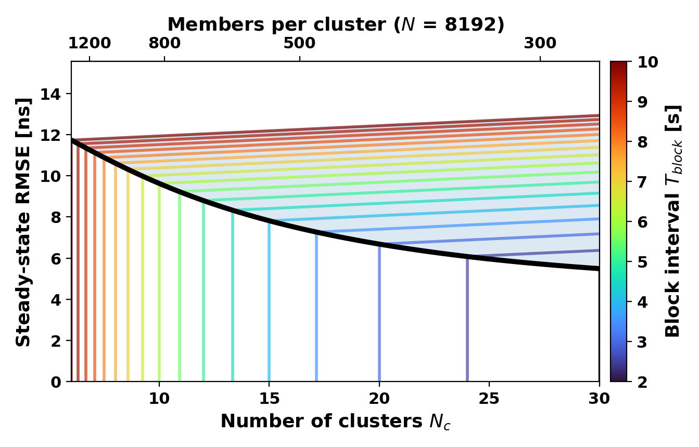

<div align="center">

# BLT-SAND

### Blockchain-Assisted Lightweight Time Synchronization for Satellite Network Decentralization

*A blockchain-inspired, hierarchical-PBFT protocol that holds a large-scale LEO constellation to **sub-10-ns** network time over inter-satellite links — without continuous reliance on GNSS or ground control.*

</div>

> **Paper.** Yong Hun Jang, Hee Soo Kim, Hong Ki Kim, Dong Hak Shin, and Sang Hyun Lee,
> *"BLT-SAND: Blockchain-Assisted Lightweight Time Synchronization for Satellite Network Decentralization."*
> Digital-twin demo: [youtu.be/kGDHFrKU2DY](https://youtu.be/kGDHFrKU2DY)

This repository hosts the three artifacts behind the paper: the **simulation** that produces the
evaluation figures, the **Unity digital twin** that visualizes and drives the testbed, and the
**consensus chain** that implements the hierarchical PBFT (h-PBFT) agreement.

---

## 1. Overview

Free-space optical inter-satellite links (ISLs) require inter-satellite clock offsets to stay within
**≈ 10 ns** for reliable pointing, acquisition, and tracking. GNSS-anchored synchronization cannot
guarantee this across a fast-moving LEO constellation: visibility is intermittent, ground contact is
sparse, and onboard oscillators drift (~1 ns/s) independently between updates.

**BLT-SAND** treats network time as a *shared, replicated state* maintained by a lightweight
blockchain consensus, rather than a value handed down from a central reference. Its contributions:

1. **Hierarchical PBFT (h-PBFT).** Full-mesh PBFT (O(n²) messaging) is replaced by a two-tier design:
   satellites aggregate offsets *locally within clusters*, and only **cluster heads** run *global*
   consensus. This shrinks the voting set and the message count while preserving Byzantine fault
   tolerance under a continuously reconfiguring topology.
2. **Consensus-validated time exchange.** Pairwise TWTT offset estimates are filtered locally
   (robust median/MAD) and confirmed by periodic global consensus, removing accumulated inter-cluster
   drift without any external/centralized anchor.
3. **Digital-twin validation.** A Unity testbed driven by real Space-Track orbital data and a
   Tendermint-based chain demonstrates sub-10-ns accuracy under realistic ISL and clock models.

<div align="center">


***Fig. 1.** Synchronization over an ISL-interconnected LEO satellite constellation.*
</div>

---

## 2. Architecture

### 2.1 Two-phase hierarchical synchronization

Synchronization alternates two complementary phases:

- **Local phase** — neighbors within the 2,500 km ISL range form clusters and exchange timestamps via
  TWTT. Each cluster head filters anomalous offset reports (robust median/MAD) and derives a
  cluster-level reference, suppressing short-term drift among nearby satellites.
- **Global phase** — cluster heads reconcile their cluster-level references over multi-hop relays and
  run h-PBFT to commit a single block, removing accumulated inter-cluster discrepancies.

Cluster membership and heads are reselected as the topology evolves. Reference design point:
**8,000 satellites / 12 clusters (~650 each)**, local cycle ≈ 5.2 s, global block interval ≈ 6 s.

<div align="center">


***Fig. 2.** Decentralized synchronization procedure.*
</div>

### 2.2 Blockchain framework and consensus

Each round produces one block (`SHA-256` hash chain):

- **Header** — round number, nonce, previous-block hash, body hash, proposer identity, signature.
  The `(round, nonce)` pair disambiguates competing proposals caused by delay/out-of-order delivery.
- **Body** — global reference time, cluster-level timing summaries, node-level offset records, and
  reliability indicators (used for later outlier filtering and cluster-head selection).

Consensus follows an h-PBFT **propose → prepare → commit** sequence with a **2/3 quorum** over the
active cluster heads. Votes are relayed (not broadcast) to limit overhead; no single satellite
unilaterally sets the network time, and disconnected satellites recover it from the chain.

<div align="center">


***Fig. 3.** BLT-SAND blockchain framework.*
</div>

---

## 3. Repository layout

```
BLT/
├── BLT_simul/          # Python  — feasibility evaluation; reproduces the paper's result panels
├── BLT_dt/             # Unity   — 3D digital-twin testbed (globe, orbits, clusters, live chain state)
├── BLT_bft_chain/      # Go/Cosmos SDK — the h-PBFT consensus chain (chain_id leo_chain-1, denom leo)
└── figures/            # paper figure images (drop fig1..fig4 panels here)
```

| Component | Maps to paper | What it is |
|---|---|---|
| [`BLT_simul/`](BLT_simul) | §IV Feasibility evaluation (Fig. 4) | Standalone Python simulator comparing BLT-SAND vs ATS / FTSP; emits the four evaluation panels. |
| [`BLT_dt/`](BLT_dt) | §IV-A Digital twin testbed (Fig. 4) | Unity scene: Earth/day-night, Space-Track TLE ingestion, cluster & fault visualization, RPC polling of the live chain. |
| [`BLT_bft_chain/`](BLT_bft_chain) | §III Consensus mechanism (Fig. 3) | Cosmos SDK / Ignite chain implementing the `blt` module (sync-block commit, epoch, h-PBFT params). |

Each subdirectory has its own `README.md` with build/run details.

---

## 4. Reproducing the evaluation

The four evaluation panels of **Fig. 4** are each produced by a standalone driver that writes a CSV
into `BLT_simul/result/`; `make_figures.py` then renders the figures from those CSVs (display-side
smoothing only — every curve is plotted at its true amplitude).

```bash
cd BLT_simul
pip install numpy scipy scikit-learn pandas geopy skyfield matplotlib

python synchronization_accuracy.py     # Fig. 4(a) — accuracy time series
python fault_tolerance.py              # Fig. 4(b) — RMSE vs faulty-node ratio
python communication_efficiency.py     # Fig. 4(c) — messages/s vs constellation size (analytical)
python deployment_flexibility.py       # Fig. 4(d) — RMSE vs cluster count / block interval (analytical)
python make_figures.py                 # renders each panel + combined figure
```

| Paper panel | Driver script | Output CSV |
|---|---|---|
| Fig. 4(a) Synchronization accuracy | `synchronization_accuracy.py` | `synchronization_accuracy_time_series.csv` |
| Fig. 4(b) Fault tolerance | `fault_tolerance.py` | `fault_tolerance_sweep.csv` |
| Fig. 4(c) Communication efficiency | `communication_efficiency.py` | `communication_efficiency.csv` |
| Fig. 4(d) Deployment flexibility | `deployment_flexibility.py` | `deployment_flexibility.csv` |

---

## 5. Design assessment (Fig. 4)

The testbed (Unity globe + Tendermint chain) is evaluated on four axes against two benchmarks: **ATS**
(average time synchronization, mean aggregation within clusters) and **FTSP** (flooding time
synchronization protocol, a single externally-anchored reference flooded hop-by-hop). The ISL
requirement is **10 ns**.

<div align="center">


***Fig. 4.** Digital twin testbed and design assessment.*
</div>

### 5(a) Synchronization accuracy

<div align="center">

</div>

RMSE between individual satellite clocks and the aggregated reference, with satellites initialized at
zero offset and **5% faulty** nodes. Without synchronization, oscillator drift accumulates and RMSE
reaches **~730 ns** over the 35 s window. After the initial transient, all schemes show an oscillatory
RMSE — synchronization events cut accumulated error while drift rebuilds it before the next update.
**FTSP** converges near **17.2 ns** and **ATS** near **14.4 ns**, both above the 10 ns line, while
**BLT-SAND** converges to **8.8 ns** and restores its steady state within a few rounds after each 6 s
cluster update. ATS stays sensitive to faulty offset reports (mean aggregation), and FTSP accumulates
residual mismatch along its flooding path; BLT-SAND instead filters unreliable measurements locally
and periodically removes inter-cluster drift through global consensus, giving tighter, more stable
error bounds.

### 5(b) Fault tolerance

<div align="center">

</div>

Steady-state RMSE as the proportion of faulty nodes increases. **FTSP** shows the largest growth —
errors introduced during hop-by-hop reference propagation reach a large portion of the network.
**ATS** rises more slowly, but biased measurements still leak into cluster references through mean
aggregation. **BLT-SAND** maintains the lowest RMSE growth while the faulty ratio stays below the
**h-PBFT quorum bound of 33%**: faulty node-level measurements may perturb local estimates but cannot
determine the agreed network-wide time. The sharper degradation beyond 1/3 reflects the Byzantine
fault-tolerance limit and confirms that h-PBFT confines local faults before they reach the global
reference.

### 5(c) Communication efficiency

<div align="center">

</div>

Each scheme's synchronization cycle is tuned so it just meets the 10 ns target, so the comparison
reflects the protocol's inherent communication demand. At the testbed scale of **N = 8,192**,
BLT-SAND needs about **1,700 messages/s**, versus **~5,300** for ATS (3.1×) and **~13,300** for FTSP
(7.8×). ATS and FTSP must shorten their synchronization intervals to compensate for growing timing
error, which raises overhead; BLT-SAND removes unreliable measurements during consensus and meets the
same target with longer intervals and far fewer messages.

### 5(d) Deployment flexibility

<div align="center">

</div>

Behavior beyond the baseline (Nₐ = 12 clusters, T_block = 6 s) when sweeping the cluster count
**Nₐ ∈ [6, 30]** and block interval **T_block ∈ [2, 10] s**. Two trade-offs emerge: for fixed
T_block, fewer clusters put more satellites per cluster (better aggregation accuracy) but raise local
aggregation latency and the minimum feasible interval; for fixed Nₐ, a shorter T_block reduces drift
accumulation between rounds at the cost of higher overhead. Configurations satisfying *both* the 10 ns
accuracy requirement and the minimum feasible interval form a **broad feasible region**, showing that
BLT-SAND supports many cluster/interval configurations while meeting ISL timing.

---

## 6. Digital twin

`BLT_dt` is a Unity testbed that renders the constellation from live **Space-Track** TLEs (Earth
rotation, day/night, orbits, K-Means clusters, faulty-node highlighting) and polls the consensus
chain over RPC to display block height and synchronization state in real time. The FSO ISL model uses
2.5 W transmit power, 1,550 nm wavelength, and 20 µrad beam divergence. Demo video:
[youtu.be/kGDHFrKU2DY](https://youtu.be/kGDHFrKU2DY).

> Credentials (e.g. Space-Track) and the chain RPC endpoint are **not** bundled — supply your own.
> Inspector fields are blank and the RPC endpoint defaults to `http://localhost:26657`.

---

## 7. Glossary

| Term | Meaning |
|---|---|
| **ISL** | Inter-satellite link (here, free-space optical) |
| **TWTT** | Two-way time transfer — pairwise timestamp exchange for clock-offset estimation |
| **h-PBFT** | Hierarchical Practical Byzantine Fault Tolerance — the two-tier consensus of BLT-SAND |
| **Cluster head** | Satellite that aggregates its cluster's offsets and participates in global consensus |
| **ATS / FTSP** | Benchmark protocols (mean-aggregation / single-source flooding) |
| **OCXO** | Oven-controlled crystal oscillator (onboard clock model, ±1 ppb) |
| **RMSE** | Root-mean-square error of satellite clocks vs the agreed reference time |

---

## 8. Citation

```bibtex
@article{jang2026bltsand,
  title   = {BLT-SAND: Blockchain-Assisted Lightweight Time Synchronization
             for Satellite Network Decentralization},
  author  = {Jang, Yong Hun and Kim, Hee Soo and Kim, Hong Ki and
             Shin, Dong Hak and Lee, Sang Hyun},
  year    = {2026},
  note    = {Update with final venue details.}
}
```

Questions: please open an issue.
